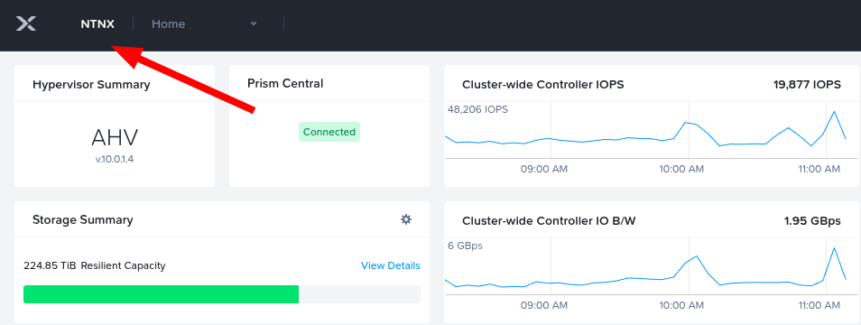
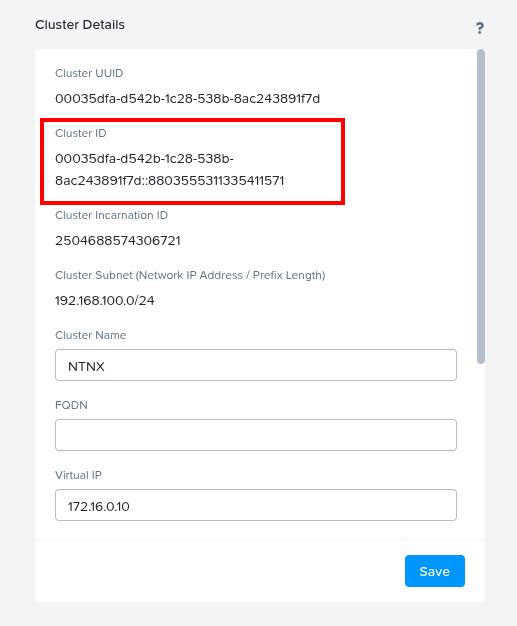
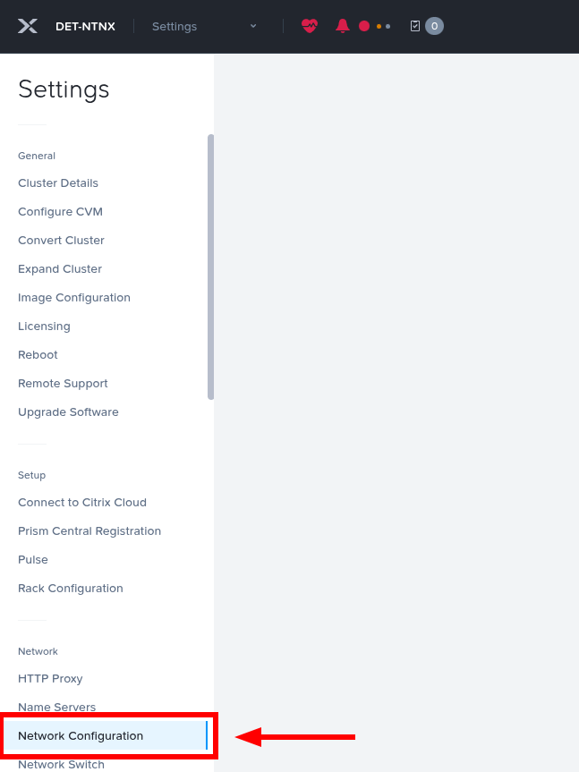
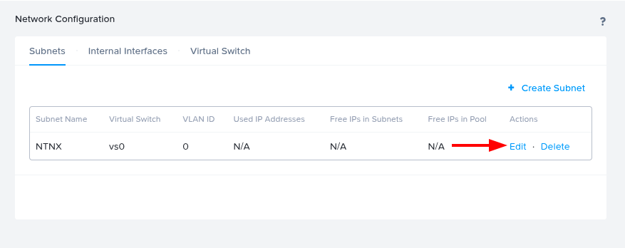
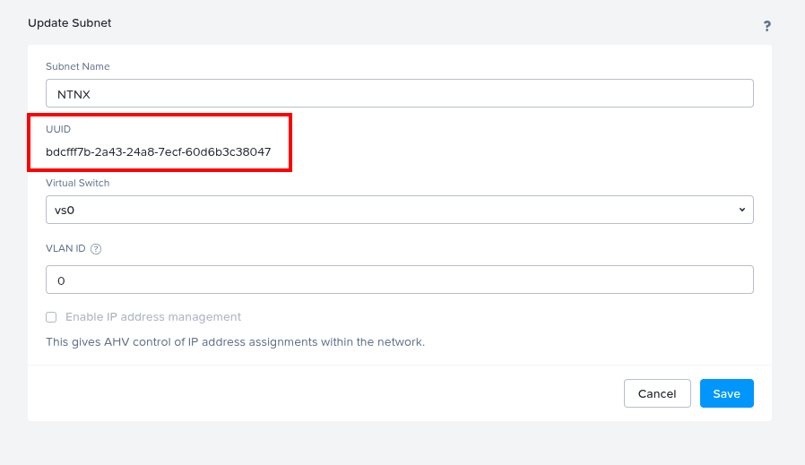

# CRIAÇÃO DE VM NO NUTANIX
---

Esse script terraform faz o provisionamento de multiplas VMs com Ubuntu e executa, 'Cloud Config' para popular os dados básicos da conexão SSH.

# INFORMAÇÕES IMPORTANTES
 ---

## Faça essas mudanças antes de começar

⚠️ Substituir a senha dos usuários 'root' e 'ubuntu' usando o comando mkpasswd

- Dica: Para criar o hash de senha que será utilizada no arquivo cloud-config.yaml é preciso ter o pacote whois instalado, caso não tenha então o comando é:

```
apt install whois
```

No Nutanix, você consegue extrair facilmente os dados necessário pelo Prism Element da seguinte forma:

## Cluser ID





## Subnet Name e Subnet UUID









### 1. No seu computador (Linux) executar o comando:

```
echo senha | mkpasswd -m sha-512 -s
```

- **root_passwd**: Preencher com o valor do comando acima.
- **owner**: Preencher com o seu nome. Ex.: Paulo Xavier
- **vm_qtd_replicas**: Preencher com a quantidade de VMs que você deseja criar.
- **vm_name**: Preencher com o nome das VMs. Como vamos criar multiplas VMs então você vai criar o nome deixando um espaço ao final para receber o número correspondente de cada VM. Ex.: **vm-server-**.
- **vm_domain**: Preencher com o nome do domínio onde a máquina será criada.
- **vm_subnet_name**: Preencher com o nome da Subnet que existe no Nutanix.
- **vm_subnet_uuid**: Preencher com o UUID da Subnet referenciada acima.
- **vm_ssh_port**: Preencher com o número da porta que o serviço do OpenSSH vai ficar escutando.
- **vm_qtd_vcpu**: Preencher com o número de vCPUs que a VM vai possuir.
- **vm_qtd_vcpu_sockets**: Preencher com o número de sockets cada vCPU vai possuir.
- **vm_qtd_memory**: Preencher com o valor em MB de memória RAM a VM vai possuir.
- **image_name**: Preencher com o nome da imagem que será utilizada para criação da VM. Essa imagem já deve existir armazenada no Nutanix.
- **vm_disk_sizes**: Preencher com o valor em MB o disco que será criado para o Sistema operacional da VM.

### 2. Preenchendo as credenciais para conexão com o Nutanix

Executar os comandos abaixo no terminal do seu computador para popular as variáveis de usuário e senha do Nutanix para execução do script:

```
export NUTANIX_USERNAME=<NOME DE USUARIO NO NUTANIX>
export NUTANIX_PASSWORD=<SENHA DO USUARIO NO NUTANIX>
```

---

## Orientações após execução do plano do Terraform

⚠️ O terraform apresentará no Output 2 informações relevantes:

### 1. Endereço IP de cada Instância criada
### 2. Chave privada da conexão SSH

O terraform irá mostrar no output o nome da variável ssh_private_pem da seguinte maneira:

**ssh_private_pem = (sensitive value) -> null**

Para exibir o valor da variável e pegar a chave para utilizar na conexão SSH, execute o comando abaixo:

```
terraform output --raw ssh_private_pem
```